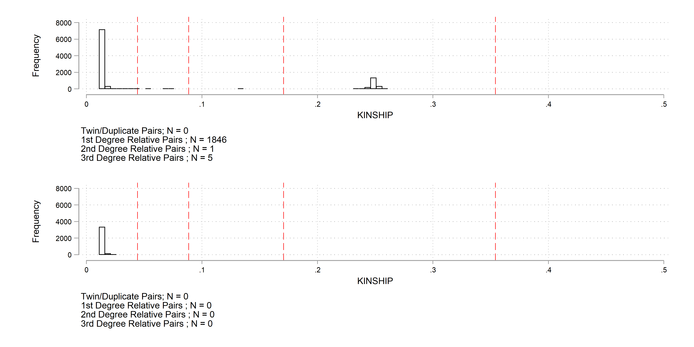
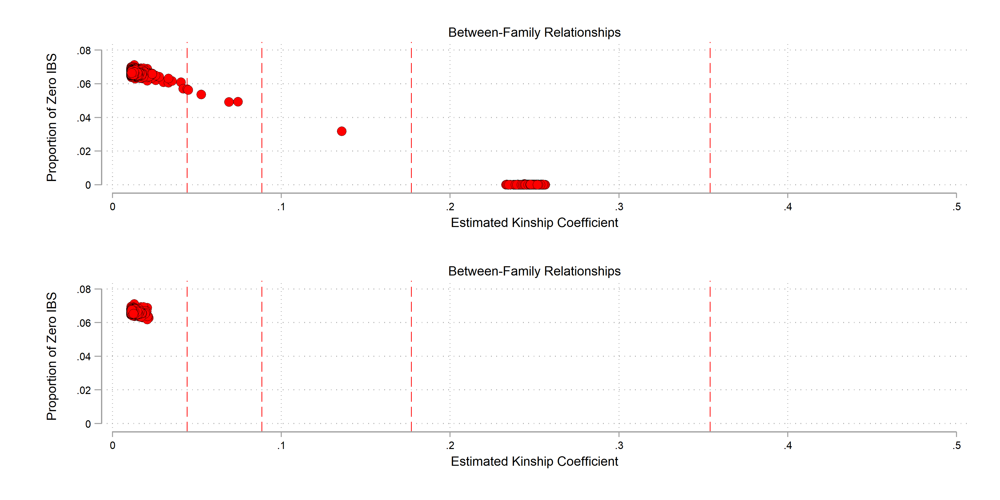

[back to opening page](https://github.com/ricanney/stata)

[back to packages](https://github.com/ricanney/stata/blob/master/documents/packages.md)

## bim2unrealted
**description** - create a subset of unrelated individuals from plink binaries using the --king-cutoff flag in ``` plink2```. the following graphs are created alongside a set of plink binaries (see below)




created files include;
 - ```input.king.cutoff.in```
 - ```input.king.cutoff.out```
 - ```input-unrelated.bed```
 - ```input-unrelated.bim```
 - ```input-unrelated.fam```
 - ```input-unrelated.log```

**remarks** - you can define a threshold for "relatedness", this number is based on the KING algorithm; where 0.354 = duplicates; 0.1770 = first degree relationships; 0.0884 = second degree relationships; 0.0442 = third degree relatinships etc) The default for this program is .0221
 
**examples** 
```
bim2unrelated , bim(file1) threshold(0.0442)
bim2unrelated , bim(file1) 
```
**installation**
```
net install bim2unrelated ,         from(https://raw.github.com/ricanney/stata/master/code/b/) replace
```

**auxiliary files**

**dependencies**
[```checkfile```](https://github.com/ricanney/stata/blob/master/documents/checkfile.md)
[```checktabbed```](https://github.com/ricanney/stata/blob/master/documents/checktabbed.md)
[```bim2ld_subset```](https://github.com/ricanney/stata/blob/master/documents/bim2ld_subset.md)
[```bim2ldexclude```](https://github.com/ricanney/stata/blob/master/documents/bim2ldexclude.md)
[```bim2count```](https://github.com/ricanney/stata/blob/master/documents/bim2count.md)
[```graphplinkkin0```](https://github.com/ricanney/stata/blob/master/documents/graphplinkkin0.md)


