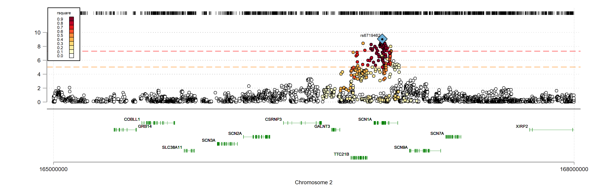

[back to opening page](https://github.com/ricanney/stata)

[back to packages](https://github.com/ricanney/stata/blob/master/documents/packages.md)

## graphlocus

**description**
* command to create a publication quality locus-plots from gwas summary data

**syntax**

```graphlocus, index(-index-) snp(-snp-) chr(-chr-) bp(-bp-) p(-p-) ldref(-ldref-) recombref(-recombref-) generef(-generef-) [maxp(-maxp-) gwsp(-gwsp-)]```
 
* ```-index-``` index marker
* ```-snp-``` varname of the marker variable
* ```-chr-``` varname of the chromosome variable
* ```-bp-``` varname of the bp variable (hg19)
* ```-p-``` varname of the p variable
* ```-ldref-``` reference genotype to calculate linkage disequilibrium
* ```-recombref-``` reference recombination rate (hg19) **-not implemented-**
* ```-generef-``` reference gene/exon co-ordinates (hg19)
* ```-maxp-``` minimum p-value to display (default = 1e-10 (10))
* ```-gwsp-``` gw-significant p-value (default 5e-8 (7.3)) 
 
**notes**
* the ```ldref``` file refers to the plink binaries of a reference set of genotypes nneded to calculate  the r^2^ that is used to color the markers
* the ```generef``` dataset refers to the ```Homo_sapiens.GRCh37.87.gtf_exon.dta``` file that carries information on the intron/exon boundaries and transcript start and end  for protein-coding genes. my code to generate this file can be found under ```stata/code/g/get-ensembl-gtf.do```



**installation**

```net install graphlocus, from(https://raw.github.com/ricanney/stata/master/code/g/) replace```

**dependencies**

```net install colorscheme, from(https://github.com/matthieugomez/stata-colorscheme/raw/master/)```

**known bugs**
* does not work if there is a gene desert __-fix-__
* problems encoding recombination rate on yaxis(2) __-removed-__ __-add later-__
