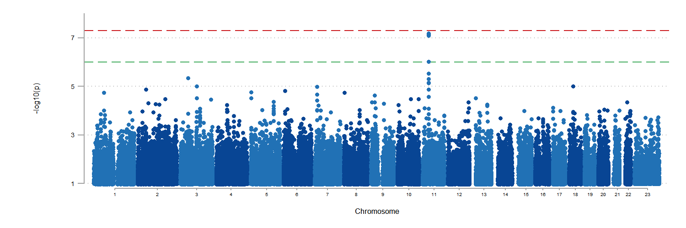

[back to opening page](https://github.com/ricanney/stata)

[back to packages](https://github.com/ricanney/stata/blob/master/documents/packages.md)


## graphmanhattan
**description** - generates a simple manhattan plot from chr bp and p-values



**syntax**	
```
syntax , chr(string asis) bp(string asis) p(string asis) [max(real 10) min(real 2) gws(real 7.3) str(real 6)]
```
**examples**
```
graphmanhattan,chr(chr) bp(bp) p(p) min(1)
```
**installation**
```
net install graphmanhattan, from(https://raw.github.com/ricanney/stata/master/code/g/) replace
```
**dependencies**
```
net install colorscheme, from(https://github.com/matthieugomez/stata-colorscheme/raw/master/)```

