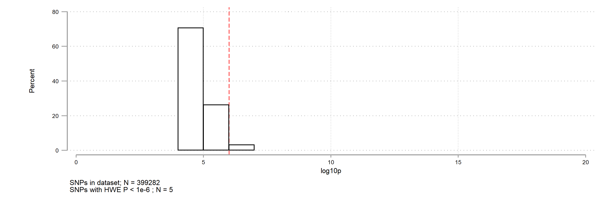

[back to opening page](https://github.com/ricanney/stata)

[back to packages](https://github.com/ricanney/stata/blob/master/documents/packages.md)

## graphplinkhwe
**description**
* command to plot distribution from *hwe plink file

**syntax**
 
```graphplinkhwe, hwe(-filename-) ```
 
* ```-filename-``` the name of the hwe file *.hwe not required

**notes**




**installation**

```net install graphplinkhwe, from(https://raw.github.com/ricanney/stata/master/code/g/) replace```


