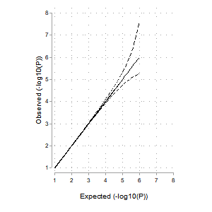

[back to opening page](https://github.com/ricanney/stata)

[back to packages](https://github.com/ricanney/stata/blob/master/documents/packages.md)


## graphqq
**description** - generates a simple qq(pp) plot from a list of p-values



**syntax**	
```	syntax , p(string asis) [max(real 10) min(real 2) gws(real 7.3) str(real 6)]```

**examples**
```
graphqq, p(p) min(1) max(8)
```
**installation**
```
net install graphqq, from(https://raw.github.com/ricanney/stata/master/code/g/) replace
```
**dependencies**
```
net install colorscheme, from(https://github.com/matthieugomez/stata-colorscheme/raw/master/)```

